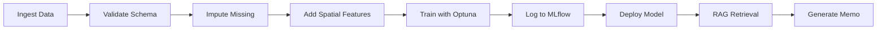

# S.P.E.C. Valuation Engine V2.0

**Spatial · Predictive · Explainable · Conversational**

A production-grade Automated Valuation Model (AVM) for residential real estate, featuring machine learning price prediction, SHAP-based explainability, RAG-enhanced market intelligence, and LLM-powered investment analysis.


---

## V2.0 Highlights

| Feature | Technology |
|---------|------------|
| **Data Validation** | Pandera schema enforcement (fail on negative prices, future year_built) |
| **Spatial Features** | H3 Hexagonal Indexing (resolution 9) + Distance to City Center |
| **Hyperparameter Tuning** | Optuna Bayesian optimization (50 trials) |
| **Experiment Tracking** | MLflow (parameters, metrics, SHAP plots, model artifacts) |
| **RAG Vector Store** | ChromaDB + sentence-transformers for market intelligence |
| **API Connectors** | Zillow/Redfin API integration (with simulation fallback) |
| **Production Ready** | Multi-stage Dockerfile, pytest test suite |

---

## Project Overview

This project demonstrates an end-to-end data science workflow: from ETL pipeline and feature engineering to model training, interpretability, and deployment as an interactive dashboard. The system identifies undervalued and overvalued properties by comparing list prices against ML predictions, with full transparency into the pricing drivers.

**Key Capabilities:**
- XGBoost regression model with Optuna-optimized hyperparameters
- SHAP TreeExplainer for feature attribution and model transparency
- H3 hexagonal spatial indexing for neighborhood-level features
- Interactive geospatial visualization with color-coded valuation status
- Real-time "what-if" renovation simulator
- RAG-enhanced LLM-generated investment memos with market context

---

## Technical Stack

| Layer | Technology |
|-------|------------|
| Machine Learning | XGBoost, scikit-learn, SHAP, Optuna |
| Data Validation | Pandera (schema enforcement) |
| Experiment Tracking | MLflow |
| Data Processing | Pandas, NumPy, SQLite, Parquet |
| Geospatial | H3, uszipcode |
| Vector Store | ChromaDB, sentence-transformers |
| Visualization | Plotly, Pydeck, Streamlit |
| LLM Integration | OpenAI API (GPT-4o-mini) |
| Frontend | Streamlit with custom CSS |
| Deployment | Docker, docker-compose |

---

## Architecture

```
spec-valuation-engine/
├── app.py                 # Streamlit dashboard application
├── Dockerfile             # Production container
├── docker-compose.yml     # Orchestration
├── config/
│   └── settings.py        # Configuration and constants (V2.0)
├── src/
│   ├── connectors.py      # NEW: API connectors (Zillow, Redfin)
│   ├── etl.py             # Data pipeline with Pandera validation
│   ├── model.py           # XGBoost + Optuna + MLflow
│   ├── spatial.py         # H3 indexing + distance features
│   └── oracle.py          # RAG + LLM investment memos
├── tests/
│   ├── test_etl.py        # ETL validation tests
│   └── test_model.py      # Model invariance tests
├── data/
│   ├── raw/               # Ingested data
│   ├── processed/         # Parquet and SQLite outputs
│   └── vector_db/         # ChromaDB persistence
└── mlruns/                # MLflow experiment tracking
```

---

## Data Pipeline (Phase 1)

The ETL module now supports real API ingestion and enforces strict data quality:

### Data Validation Rules

| Constraint | Action |
|------------|--------|
| `price < 0` | **FAIL** - NegativePriceError |
| `year_built > current_year` | **FAIL** - FutureYearBuiltError |
| `sqft IS NULL` | **IMPUTE** - Use neighborhood median |

```python
# Example: Run ETL with validation
from src.etl import run_etl_pipeline

df = run_etl_pipeline(validate=True)
# Raises NegativePriceError if any price < 0
```

### API Connectors

```python
from src.connectors import ZillowConnector, UnifiedDataIngester

# Single source
zillow = ZillowConnector()
df = zillow.fetch_listings("94107", limit=100)

# Multi-source ingestion
ingester = UnifiedDataIngester()
df = ingester.ingest_all_zip_codes(listings_per_zip=50)
```

---

## Spatial Features (Phase 2)

### H3 Hexagonal Indexing

Resolution 9 provides ~0.1 km² hexagons for granular neighborhood analysis:

```python
from src.spatial import add_h3_index, add_distance_to_center

df = add_h3_index(df, resolution=9)
df = add_distance_to_center(df)  # Distance to SF City Hall

# Or add all spatial features at once
df = add_all_spatial_features(df)
```

### Model Features V2

| Feature | Description |
|---------|-------------|
| `sqft` | Square footage |
| `bedrooms` | Bedroom count |
| `year_built` | Construction year |
| `condition` | Rating 1-5 |
| `h3_index` | Hexagonal cell ID |
| `distance_to_center_km` | Distance to downtown |

---

## Model Training (Phase 2 & 4)

### Hyperparameter Optimization with Optuna

```python
from src.model import ValuationModel

model = ValuationModel()
model.train(force=True, optimize=True, n_trials=50)
# Searches: learning_rate, max_depth, subsample, n_estimators, etc.
```

### MLflow Experiment Tracking

All training runs are logged to MLflow:

```python
# Logged artifacts:
# - Parameters (learning_rate, max_depth, etc.)
# - Metrics (train_rmse, test_rmse, train_mae, test_mae, train_r2, test_r2)
# - SHAP summary plot
# - Serialized model

# View experiments:
mlflow ui --port 5000
```

---

## RAG-Enhanced Oracle (Phase 3)

### Vector Store Setup

```python
from src.oracle import get_vector_store, ingest_market_report

# Get or create vector store
vs = get_vector_store()

# Ingest a market report PDF
chunks = ingest_market_report(Path("data/market_reports/Q4_2025.pdf"))
print(f"Ingested {chunks} chunks")
```

### Semantic Retrieval

```python
from src.oracle import get_market_context

# RAG-enhanced context retrieval
context = get_market_context("94107")
# Returns: neighborhood, sentiment, news, risk_factors, rag_context
```

### Investment Memo Generation

```python
from src.oracle import generate_investment_memo

memo = generate_investment_memo(
    price=950000,
    shap_data=explanation,
    zip_code="94107"
)
# Returns HTML-formatted investment analysis
```

---

## Docker Deployment (Phase 5)

### Quick Start

```bash
# Build and run
docker-compose up -d

# Access dashboard
open http://localhost:8501
```

### Development Mode

```bash
# Run with hot reload
docker-compose --profile dev up app-dev
```

### With MLflow UI

```bash
# Run app + MLflow tracking server
docker-compose --profile mlops up
```

---

## Testing (Phase 5)

### Run Tests

```bash
# All tests
pytest tests/ -v

# ETL tests only
pytest tests/test_etl.py -v

# Model invariance tests
pytest tests/test_model.py -v
```

### Key Test Cases

| Test | Description |
|------|-------------|
| `test_negative_price_fails` | Pipeline fails if price < 0 |
| `test_future_year_fails` | Pipeline fails if year_built > current year |
| `test_sqft_monotonicity` | Increasing sqft must NOT decrease price |
| `test_condition_monotonicity` | Better condition must NOT decrease price |

---

## Getting Started

### Local Development

```bash
# Clone and navigate to project
cd S.P.E.C-Valuation-1

# Create virtual environment
python -m venv venv
source venv/bin/activate

# Install dependencies
pip install -r requirements.txt

# Run the application
streamlit run app.py
```

### Environment Variables

Create `.env` file:

```bash
# OpenAI for investment memos
OPENAI_API_KEY=sk-...

# RapidAPI for real estate data (optional)
RAPIDAPI_KEY=...
```

---

## Performance Optimizations

- **Caching**: Streamlit's `@st.cache_data` and `@st.cache_resource` decorators
- **Data Format**: Parquet for fast columnar reads
- **Model Persistence**: Pickled model with MLflow artifact storage
- **Vector Store**: ChromaDB with persistent storage
- **Docker**: Multi-stage build for minimal image size

---

## MLOps Workflow



---

## License

MIT License
